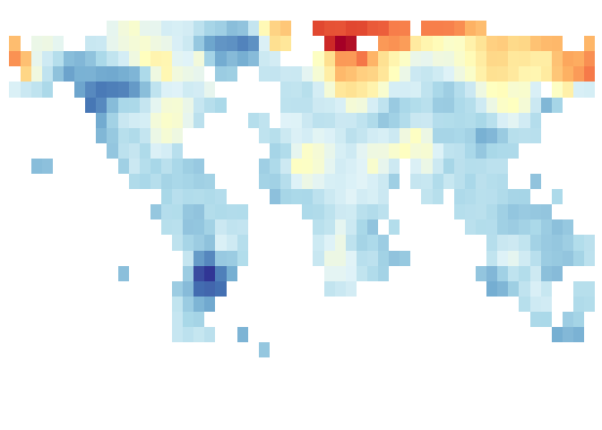
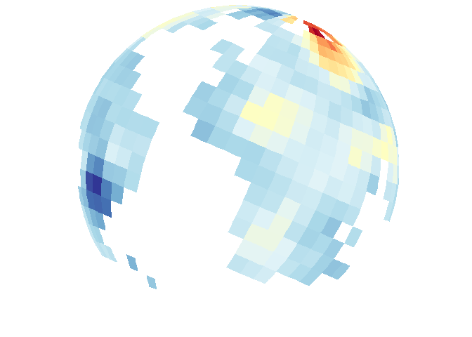

<!-- README.md is generated from README.Rmd. Please edit that file -->
mapmate
=======

[](https://travis-ci.org/leonawicz/mapmate) [](https://ci.appveyor.com/project/leonawicz/mapmate) [](https://codecov.io/github/leonawicz/mapmate?branch=master)

`mapmate` (map animate) is an R package for map animation. It is used to generate and save a sequence of plots to disk as a still image sequence intended for later use in data animation production.

Here is the complete online [documentation and tutorials with code examples](https://leonawicz.github.io/mapmate/).

Installation and bug reporting
------------------------------

Install the latest development version (0.3.0) from github:

``` r
install.packages("devtools")
devtools::install_github("leonawicz/rvtable")
```

Please file a minimal reproducible example of any clear bug at [github](https://github.com/leonawicz/rvtable/issues).

Introduction and basic example
------------------------------

The `mapmate` package is used for map- and globe-based data animation pre-production. Specifically, `mapmate` functions are used to generate and save to disk a series of map graphics that make up a still image sequence, which can then be used in video editing and rendering software of the user's choice. This package does not make simple animations directly within R, which can be done with packages like `animation`. `mapmate` is more specific to maps, hence the name, and particularly suited to 3D globe plots of the Earth. Functionality and fine-grain user control of inputs and outputs are limited in the current package version.

``` r
library(mapmate)
library(dplyr)
data(annualtemps)
annualtemps
#> # A tibble: 55,080 x 4
#>          lon      lat  Year     z
#>        <dbl>    <dbl> <int> <dbl>
#>  1 -176.6667 53.66633  2010  1.09
#>  2 -176.6667 66.99967  2010  3.21
#>  3 -176.6667 73.66633  2010  2.76
#>  4 -170.0000 53.66633  2010  0.91
#>  5 -170.0000 60.33300  2010  2.47
#>  6 -170.0000 66.99967  2010  2.73
#>  7 -163.3333 20.33300  2010  0.19
#>  8 -163.3333 53.66633  2010  0.79
#>  9 -163.3333 60.33300  2010  1.43
#> 10 -163.3333 66.99967  2010  1.28
#> # ... with 55,070 more rows

library(RColorBrewer)
pal <- rev(brewer.pal(11, "RdYlBu"))

temps <- mutate(annualtemps, frameID = Year - min(Year) + 1)
frame1 <- filter(temps, frameID == 1)  # subset to first frame
id <- "frameID"

save_map(frame1, z.name = "z", id = id, ortho = FALSE, col = pal, type = "maptiles", 
    save.plot = FALSE, return.plot = TRUE)
save_map(frame1, z.name = "z", id = id, col = pal, type = "maptiles", save.plot = FALSE, 
    return.plot = TRUE)
```



The above is only a very basic initial example of static 2D and 3D maps. See the [introduction vignette](http://leonawicz.github.io/mapmate/articles/mapmate.html) for more complete and typical usage examples:

-   Generate a data frame containing monthly map data (optionally seasonal or annual aggregate average data) in the form of an n-year moving or rolling average based on an input data frame of raw monthly data.
-   Generate a sequence of still frames of:
    -   map data for use in a flat map animation.
    -   dynamic/temporally changing map data projected onto a static globe (3D Earth)
    -   static map data projected onto rotating globe
    -   dynamic map data projected onto rotating globe
-   Parallel processing examples using `mclapply`
-   Convenient iterator wrapper function
-   Comparison of map tiles, map lines, and polygons
-   Non-map data example (time series line growth)

This and other vignettes covering more examples, including network maps with great circle arcs and generating video with `ffmpeg`, can be found at the [mapmate](http://leonawicz.github.io/rvtable/articles/rvtable.html) website.

Other features and functionality will be added in future package versions.
